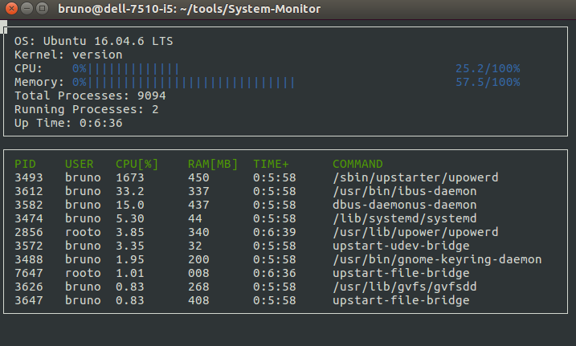

# Linux-System-Mointor

## Overview

This is an htop like application for monitoring memory and CPU usage in a Linux OS.

## Make
This project uses [Make](https://www.gnu.org/software/make/). The Makefile has four targets:
* `build` compiles the source code and generates an executable
* `format` applies [ClangFormat](https://clang.llvm.org/docs/ClangFormat.html) to style the source code
* `debug` compiles the source code and generates an executable, including debugging symbols
* `clean` deletes the `build/` directory, including all of the build artifacts

## Usage

1. Clone the project repository: `git clone https://github.com/brunoeducsantos/Linux-System-Monitor.git`
2. Build the project: `make build`